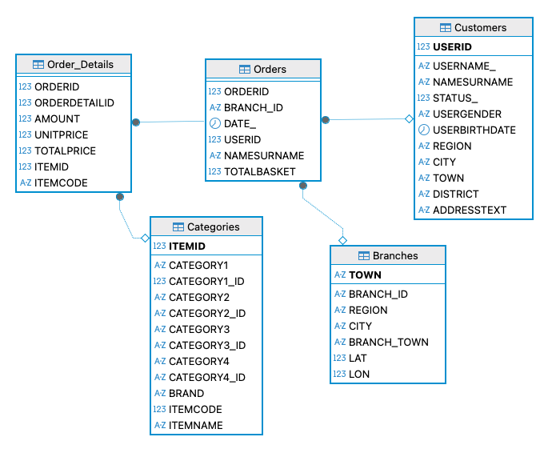

# Benchmark CRUD – Java + Cassandra / PostgreSQL / MySQL

Projekt ma na celu porównanie wydajności operacji CRUD wykonywanych na trzech różnych bazach danych:

- **Apache Cassandra**
- **Apache Cassandra Old**
- **PostgreSQL**
- **MySQL**

Aplikacja wgrywa zestaw testowych danych 3A Superstore (Market Orders Data-CRM) z kaggle.com

- Branches.csv - 11,2 KB
- Categories_eng.csv - 3,81 MB
- Customers_eng.csv - 15,9 MB
- Orders.csv - 684 MB
- Order_details.csv - 2,24 GB



### Create (INSERT)

Klasy `Create` odpowiadają za tworzenie tabeli `employees_by_branch` oraz wstawianie danych do niej.

#### Tworzenie tabeli

Metoda `CreateEmployee()` tworzy tabelę `employees_by_branch` w bazie `cassandraSpeedTestDb`, jeśli jeszcze nie istnieje.

Tabela zawiera następujące kolumny:

| Kolumna        | Typ       | Opis                           |
|----------------|-----------|--------------------------------|
| branch_id      | text      | ID oddziału                    |
| employeeid     | UUID      | Unikalny identyfikator pracownika |
| first_name     | text      | Imię pracownika                |
| last_name      | text      | Nazwisko pracownika            |
| position       | text      | Stanowisko pracownika          |
| salary         | decimal   | Wynagrodzenie                  |
| email          | text      | Email pracownika               |
| phone_number   | text      | Numer telefonu pracownika      |

Metoda mierzy czas wykonania operacji w nanosekundach i zwraca go jako `Long`. 

Metoda `InsertEmployee(List<String> values)` odpowiada za wstawianie rekordów do tabeli `employees_by_branch`.

- Każdy rekord należy podać jako ciąg CQL albo Sql `INSERT INTO ...`.
- Wszystkie rekordy są wykonywane w pętli z użyciem `BATCH` dla lepszej wydajności.
- Metoda mierzy czas wstawiania danych i zwraca go w nanosekundach.

### Read (Odczyt danych)

Klasa `Read` (dla MySQL/PostgreSQL/Cassandra) odpowiada za wykonywanie operacji odczytu z bazy danych.

Każda metoda odczytu mierzy czas wykonania operacji w nanosekundach i zwraca go jako `Long`. Dzięki temu można porównać wydajność różnych zapytań i implementacji.

#### Dostępne operacje odczytu:

- **SelectOrders** – odczytuje wszystkie rekordy z tabeli `orders_by_branch`.
- **SelectOrderDetails** – odczytuje wszystkie rekordy z tabeli `order_details_by_order`.
- **SelectCustomers** – odczytuje wszystkie rekordy z tabeli `customers`.
- **SelectCustomerOrderDetails** – odczytuje szczegóły zamówień dla każdego klienta z tabeli `orders_by_user`.
- **CountOrdersForCustomer** – zlicza liczbę zamówień dla każdego klienta (agregacja po `userid`).
- **SelectAll** – odczytuje wszystkie rekordy z tabeli `orders_by_user` a dla sql wykonuje łączenie wszystkich tabel korzystając z Join.

### Delete (Usuwanie danych)

Klasa `Delete` (dla MySQL/PostgreSQL/Cassandra) odpowiada za usuwanie danych z tabeli.

Każda metoda mierzy czas wykonania operacji w nanosekundach i zwraca go jako `Long`, co pozwala ocenić wydajność operacji usuwania.

#### Dostępne operacje usuwania:

- **deleteTableRow(Row row)** – usuwa pojedynczy wiersz z tabeli na podstawie jego identyfikatora lub klucza głównego.
- **deleteAllTableContent()** – usuwa wszystkie dane z tabeli, pozostawiając strukturę tabeli bez zmian.
- **deleteTable()** – usuwa całą tabelę wraz z jej strukturą.

### Update (Modyfikacja danych)

Klasa `Update` (dla MySQL/PostgreSQL/Cassandra) odpowiada za aktualizację danych w tabeli.

Każda metoda mierzy czas wykonania operacji w nanosekundach i zwraca go jako `Long`, co pozwala ocenić wydajność operacji aktualizacji.

#### Dostępne operacje aktualizacji:

- **updateEmployeeTable(List<Row> rows)** – modyfikuje wiele rekordów naraz w tabeli przy użyciu batch, co pozwala na efektywne przetwarzanie większej liczby wierszy.
- **updateRecordInEmployeeTable(Row row)** – modyfikuje pojedynczy rekord w tabeli na podstawie jego identyfikatora lub klucza głównego.


Dzięki temu możliwe jest zestawienie szybkości poszczególnych operacji w różnych systemach bazodanowych.

---

## 1. Wymagania

### Oprogramowanie
- Java 25
- Maven
- Docker 

### Bazy danych
Aplikacja zakłada istnienie uruchomionych instancji:

- Apache Cassandra
- Apache Cassandra old
- PostgreSQL
- MySQL

---

## 2. Konfiguracja

Bazy danych zostały uruchomione przy użyciu `docker-compose` znajdującego się w repozytorium.  
Wszystkie bazy korzystają ze standardowych plików konfiguracyjnych, z wyjątkiem **MySQL**, który wymagał dostosowania ustawień w celu poprawy wydajności podczas testów.

**Treść zmodyfikowanego pliku konfiguracyjnego MySQL (`my.cnf`):**

```ini
[mysqld]
innodb_buffer_pool_size = 3G
innodb_buffer_pool_chunk_size = 128M
innodb_buffer_pool_instances = 4
tmp_table_size = 1G
max_heap_table_size = 1G
sort_buffer_size = 16M
join_buffer_size = 16M
group_concat_max_len = 16777216  # 16 MB
innodb_read_io_threads = 4
innodb_write_io_threads = 4
innodb_flush_log_at_trx_commit = 2
innodb_file_per_table = 1
innodb_flush_method = O_DIRECT
innodb_lru_scan_depth = 256
general_log = 0
slow_query_log = 1
slow_query_log_file = /var/log/mysql/slow.log
long_query_time = 2  # loguj zapytania dłuższe niż 2 sekundy
```
**Indeksy zastosowane w MySql:**
```ini
ALTER TABLE Categories_ENG
ADD INDEX idx_categories_item (itemid);
ALTER TABLE Order_Details
ADD INDEX idx_orderdetails_order (orderid),
ADD INDEX idx_orderdetails_item (itemid);
ALTER TABLE Branches
ADD INDEX idx_branches_branchid (branch_id);
ALTER TABLE Customers_ENG
ADD INDEX idx_customers_userid (userid);
ALTER TABLE Orders
ADD INDEX idx_orders_userid (userid),
ADD INDEX idx_orders_branch (branch_id),
ADD INDEX idx_orders_date (date_),
ADD INDEX idx_orders_orderid (orderid);
```


